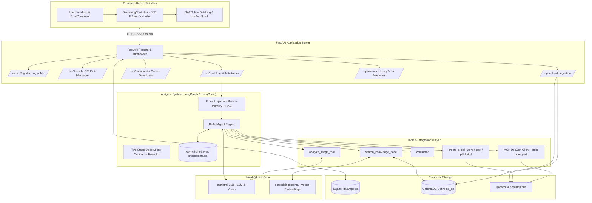

# Shield AI — Sovereign AI Platform: Comprehensive System Context

## 1. Project Overview & Mission

**Shield AI** is an enterprise-grade, sovereign, local-first AI assistant and document intelligence platform. It operates completely on-premise / offline without reliance on external cloud APIs, providing private conversational AI, Retrieval-Augmented Generation (RAG), multimodal vision analysis, persistent conversation threads, autonomous long-term user memory extraction, and full-spectrum document generation (Word, Excel, PowerPoint, PDF, HTML).

### Primary Capabilities
1. **Local LLM & Vision Reasoning**: Powered entirely by a local **Ollama** engine (defaulting to `ministral-3:3b` for language and vision, and `embeddinggemma` for embeddings).
2. **Persistent Conversation & Memory System**: Relational storage (SQLite + SQLAlchemy 2.x) tracking users, threads, chronological messages, and background-extracted long-term user memories.
3. **Agent State & Checkpointing**: Powered by **LangGraph** with `AsyncSqliteSaver` checkpoints to preserve multi-turn agent execution states.
4. **Document Ingestion & RAG**: Multi-format document parser (`pypdf`, text, markdown) backed by **ChromaDB** with thread-scoped and user-scoped context retrieval.
5. **Autonomous Document Generation & MCP Integration**: Integrates Model Context Protocol (**MCP**) via `mcp-docgen` and resilient local tools (`openpyxl`, `docx_writer`, `pptx_writer`, `pdf_writer`, `html_writer`) for generating production-ready spreadsheets, slides, and reports.
6. **ChatGPT-Grade Reactive Frontend**: High-performance React 19 + Vite interface featuring pure black styling, SSE token streaming, `requestAnimationFrame` token batching, and directional auto-scroll.

---

## 2. High-Level Architecture



---

## 3. Technology Stack & Key Dependencies

### Backend Stack
- **Framework**: FastAPI (Python 3.10+) with Uvicorn ASGI server.
- **Agent Orchestration**: LangGraph, LangChain (`langchain-core`, `langchain-community`, `langchain-ollama`).
- **Agent Checkpointing**: `langgraph-checkpoint-sqlite` (`AsyncSqliteSaver`).
- **LLM & Vision Provider**: Ollama HTTP API (`http://localhost:11434`), models: `ministral-3:3b`.
- **Vector Database & Embeddings**: ChromaDB (`langchain-chroma`) with Ollama embeddings (`embeddinggemma`).
- **Database & ORM**: SQLite 3 with SQLAlchemy 2.x.
- **Authentication & Security**: JWT (`pyjwt`), password hashing (`bcrypt`), scoped user data isolation.
- **Document Generation & MCP**: `mcp-docgen`, `langchain-mcp-adapters`, `openpyxl`, `pypdf`.

### Frontend Stack
- **Framework**: React 19 with Vite 8 bundler.
- **Styling**: Vanilla CSS design system (pure black `#000000`, elevated cards `#141416` / `#212121`).
- **Icons**: `lucide-react`.
- **Markdown & Code Rendering**: `react-markdown` with `remark-gfm`.
- **Streaming & Concurrency**: Custom `StreamingController` leveraging `fetch` ReadableStreams, SSE text decoding, and `AbortController`.
- **Rendering Performance**: `requestAnimationFrame` token batch queue to eliminate main-thread rendering freezes during high token throughput.

---

## 4. Repository Directory Structure

```
d:\sih\project\
├── backend/
│   ├── app/
│   │   ├── core/
│   │   │   ├── __init__.py
│   │   │   └── security.py           # Password hashing (bcrypt), JWT creation/decoding, user auth dependencies
│   │   ├── mcp/
│   │   │   ├── __init__.py           # Package exports for MCP client and output directory
│   │   │   ├── mcp_client.py         # MultiServerMCPClient manager, stdio transport, tool description sanitizer
│   │   │   └── out/                  # Output directory for agent-generated documents (.docx, .xlsx, etc.)
│   │   ├── models/
│   │   │   ├── __init__.py           # Re-exports models
│   │   │   ├── chat.py               # SQLAlchemy models: Conversation, Message, LongTermMemory
│   │   │   └── user.py               # SQLAlchemy model: User
│   │   ├── routers/
│   │   │   ├── __init__.py
│   │   │   ├── auth.py               # /auth/register, /auth/login, /auth/me
│   │   │   ├── chat.py               # /api/chat (sync) & /api/chat/stream (SSE streaming)
│   │   │   ├── documents.py          # /api/documents/download (secure workspace file downloads)
│   │   │   ├── memory.py             # /api/memory (view and delete long-term user memories)
│   │   │   ├── threads.py            # /api/threads (thread CRUD and message histories)
│   │   │   └── upload.py             # /api/upload (PDF, text, image indexing into ChromaDB)
│   │   ├── schemas/
│   │   │   ├── __init__.py
│   │   │   ├── auth.py               # Pydantic schemas: UserCreate, UserLogin, UserResponse, Token
│   │   │   └── chat.py               # Pydantic schemas: ChatRequest, ChatResponse, ThreadCreate, etc.
│   │   ├── agent.py                  # LangGraph ReAct agent, AsyncSqliteSaver, streaming engine, CLI Deep Agent
│   │   ├── config.py                 # Pydantic BaseSettings: database paths, Ollama URLs, models, JWT secrets
│   │   ├── database.py               # SQLite engine, sessionmaker, Base declaration, init_db()
│   │   ├── memory.py                 # Memory extraction LLM prompt, title generation, prompt formatters
│   │   ├── prompt.json               # System prompts, title generation prompt, memory extraction prompts
│   │   ├── rag.py                    # ChromaDB vector store, document loaders, chunking, retrieval logic
│   │   ├── repositories.py           # Clean data access layer: ThreadRepository, MessageRepository, MemoryRepository
│   │   ├── tools.py                  # Tool definitions: RAG, vision, calculator, openpyxl, and direct doc writers
│   │   └── vision.py                 # Ollama vision inference wrapper (base64 image payload handling)
│   ├── data/
│   │   ├── app.db                    # Main SQLite application database
│   │   └── checkpoints.db            # LangGraph agent state checkpoint SQLite database
│   ├── uploads/                      # Uploaded files storage
│   ├── requirements.txt              # Python dependency manifest
│   └── pyproject.toml                # Python project configuration
├── frontend/
│   ├── src/
│   │   ├── api/
│   │   │   ├── auth.js               # API methods for registration, login, user fetching
│   │   │   └── chat.js               # API methods for threads, messages, sync chat, memories
│   │   ├── assets/                   # Static logos and graphic assets
│   │   ├── components/
│   │   │   ├── auth/
│   │   │   │   └── AuthModal.jsx     # Login and registration modal dialog
│   │   │   ├── chat/
│   │   │   │   ├── ChatErrorBoundary.jsx  # React error boundary for chat failures
│   │   │   │   ├── ChatInput.jsx          # Input textarea with attachment triggers
│   │   │   │   ├── ChatMessageList.jsx    # Virtualized-feel message list with jump-to-latest button
│   │   │   │   ├── MarkdownMessage.jsx    # ReactMarkdown renderer with GFM tables & code blocks
│   │   │   │   ├── MessageActions.jsx     # Copy, retry, edit, and download buttons
│   │   │   │   ├── QuickTasks.jsx         # Prompt suggestions for new threads
│   │   │   │   └── ToolExecution.jsx      # UI collapsible box displaying tool calls and statuses
│   │   │   ├── composer/
│   │   │   │   ├── AttachmentMenu.jsx     # File attachment options dropdown
│   │   │   │   ├── AttachmentPreview.jsx  # Chips displaying staged uploads
│   │   │   │   ├── ChatComposer.jsx       # Consolidated composer card
│   │   │   │   ├── ComposerToolbar.jsx    # Bottom action bar of composer
│   │   │   │   ├── DocumentAttachment.jsx # Document upload handler
│   │   │   │   ├── ImageAttachment.jsx    # Image upload and preview handler
│   │   │   │   ├── ModeSelector.jsx       # Chat modes (Normal, Deep Research, etc.)
│   │   │   │   └── ModelSelector.jsx      # Model picker display
│   │   │   └── layout/
│   │   │       ├── Footer.jsx             # Status footer (optional display)
│   │   │       ├── Sidebar.jsx            # Thread history, search, account switcher, direct upload
│   │   │       └── TopBar.jsx             # Minimalist header with connection and model badges
│   │   ├── hooks/
│   │   │   ├── useAttachments.js          # File staging, validation, preview state
│   │   │   ├── useAutoResizeTextarea.js   # Dynamic expansion of textarea
│   │   │   ├── useAutoScroll.js           # Smart stick-to-bottom scroll logic
│   │   │   └── useChatState.js            # Master chat state machine (threads, messages, streaming)
│   │   ├── services/
│   │   │   └── streamingController.js     # SSE reader, AbortController manager, thread stream isolation
│   │   ├── tests/
│   │   │   └── streaming.test.js          # Unit tests for streaming and batching
│   │   ├── App.css                        # Supplementary component styling
│   │   ├── App.jsx                        # Root React layout and provider
│   │   ├── index.css                      # Global design system tokens and resets
│   │   └── main.jsx                       # React DOM entrypoint
│   ├── package.json                       # Node dependencies and scripts
│   └── vite.config.js                     # Vite build configuration
├── mcp.json                               # MCP server registry configuration
├── mcp_implementation.md                  # Comprehensive documentation of MCP Go-newline 500 fixes
├── memory_thread_db.md                    # Database & memory architecture specification
├── ui_bug_fix.md                          # Frontend streaming & scrolling fix documentation
├── main_react.md                          # React/FastAPI integration reference
└── README.md                              # Quick-start setup guide
```

---

## 5. Database Schema & Persistence Layer

The application database is stored locally at `backend/data/app.db` via SQLite.

### 5.1 Tables & Relations

```
  ┌─────────────────────────┐
  │         users           │
  ├─────────────────────────┤
  │ id (PK, Integer)        │◄──────┐
  │ name (String)           │       │
  │ email (String, Unique)  │       │
  │ organisation (String)   │       │
  │ designation (String)    │       │
  │ password (Hashed String)│       │
  │ created_at (DateTime)   │       │
  │ updated_at (DateTime)   │       │
  └───────────┬─────────────┘       │
              │ 1:N                 │ 1:N
              ▼                     │
  ┌─────────────────────────┐       │
  │      conversations      │       │
  ├─────────────────────────┤       │
  │ id (PK, UUID String)    │       │
  │ user_id (FK -> users.id)│       │
  │ title (String)          │       │
  │ created_at (DateTime)   │       │
  │ updated_at (DateTime)   │       │
  └───────────┬─────────────┘       │
              │ 1:N                 │
              ▼                     │
  ┌─────────────────────────┐       │
  │        messages         │       │
  ├─────────────────────────┤       │
  │ id (PK, UUID String)    │       │
  │ thread_id (FK -> conv)  │       │
  │ role (user/asst/system) │       │
  │ content (Text)          │       │
  │ message_type (text/...) │       │
  │ created_at (DateTime)   │       │
  └─────────────────────────┘       │
                                    ▼
                        ┌─────────────────────────┐
                        │   long_term_memories    │
                        ├─────────────────────────┤
                        │ id (PK, UUID String)    │
                        │ user_id (FK -> users.id)│
                        │ memory_key (String)     │
                        │ memory_value (Text)     │
                        │ created_at (DateTime)   │
                        │ updated_at (DateTime)   │
                        │ UQ: (user_id, key)      │
                        └─────────────────────────┘
```

### 5.2 Agent Checkpoints Database
In addition to the relational database, LangGraph maintains multi-turn agent conversation checkpoints in `backend/data/checkpoints.db` using `AsyncSqliteSaver`. This preserves tool invocations, intermediate steps, and scratchpad memory for each thread ID.

---

## 6. Detailed API Reference

All protected endpoints require an `Authorization: Bearer <jwt_token>` header.

### 6.1 Authentication (`/auth`)
| Method | Path | Description | Payload |
|---|---|---|---|
| `POST` | `/auth/register` | Register a new user account | `{ name, email, organisation, designation, password }` |
| `POST` | `/auth/login` | Login and receive JWT access token | `{ email, password }` |
| `GET` | `/auth/me` | Fetch profile for authenticated user | *None* |

### 6.2 Conversation Threads (`/api/threads`)
| Method | Path | Description | Response |
|---|---|---|---|
| `POST` | `/api/threads` | Create a new conversation thread | `{ id, user_id, title, created_at, updated_at }` |
| `GET` | `/api/threads` | List all threads owned by current user | Array of thread objects (ordered by `updated_at DESC`) |
| `GET` | `/api/threads/{id}` | Get metadata for a specific thread | Thread object |
| `GET` | `/api/threads/{id}/messages` | Retrieve full chronological message history | Array of message objects (ordered by `created_at ASC`) |
| `DELETE` | `/api/threads/{id}` | Delete a thread and cascade delete messages | `204 No Content` |

### 6.3 Agent Chat & Streaming (`/api/chat`)
| Method | Path | Type | Description |
|---|---|---|---|
| `POST` | `/api/chat` | JSON | Non-streaming chat execution. Stores messages, calls agent, runs title generation & memory extraction in background tasks. |
| `POST` | `/api/chat/stream` | SSE (`text/event-stream`) | Real-time Server-Sent Events stream emitting chunk tokens, tool notices, and completion events. |

#### SSE Event Payload Formats:
- `init`: `data: {"type": "init", "thread_id": "<uuid>"}`
- `token`: `data: {"type": "token", "content": "text token"}`
- `done`: `data: {"type": "done", "thread_id": "<uuid>", "title": "Updated Title", "message": "Full Text"}`
- `error`: `data: {"type": "error", "error": "Error message"}`

### 6.4 Document Ingestion & RAG (`/api/upload`)
| Method | Path | Content-Type | Description |
|---|---|---|---|
| `POST` | `/api/upload` | `multipart/form-data` | Upload `.pdf`, `.txt`, `.md`, or images (`.png`, `.jpg`, etc.). Automatically extracts chunks, embeds via `embeddinggemma`, saves to ChromaDB with `thread_id` and `user_id` tags, and injects an event into thread messages. |

### 6.5 Secure Document Downloads (`/api/documents`)
| Method | Path | Query Params | Description |
|---|---|---|---|
| `GET` | `/api/documents/download` | `path=<relative_or_absolute_path>` | Safely downloads generated `.docx`, `.xlsx`, `.pptx`, `.pdf`, or `.html` files. Enforces project workspace boundary validation to prevent directory traversal attacks. |

### 6.6 User Long-Term Memory (`/api/memory`)
| Method | Path | Description |
|---|---|---|
| `GET` | `/api/memory` | Retrieve all persistent key-value memories extracted for the user |
| `DELETE` | `/api/memory/{id}` | Delete a specific long-term memory entry |

---

## 7. AI Agent, Prompts & Tool Execution Architecture

### 7.1 Agent Execution Flow
1. **Request Intake**: User sends a prompt via `/api/chat` or `/api/chat/stream`.
2. **Context Compilation** (`_build_full_prompt`):
   - Loads base instructions from `app/prompt.json`.
   - Injects user long-term memories retrieved from SQLite (`format_memories_for_prompt`).
   - Queries ChromaDB for top-K semantically relevant document chunks tagged with the active `thread_id` (`retrieve_context`).
3. **Tool Registration**:
   - `search_knowledge_base`: Retrieves uploaded PDF/document segments from ChromaDB.
   - `analyze_image_tool`: Sends base64-encoded image to Ollama vision model.
   - `calculator`: Evaluates pure mathematical calculations.
   - `create_excel_document`: Builds native spreadsheets via `openpyxl`.
   - `create_word_document`, `create_presentation_document`, `create_pdf_document`, `create_html_document`: Direct document generation.
   - `save_as_document`: Auto-inspects agent message state to write conversation text to target document formats.
   - MCP Tools: Dynamic stdio tools loaded from `mcp-docgen`.
4. **Execution & Checkpointing**:
   - Agent is executed using `create_agent` bound with `AsyncSqliteSaver` pointing to `data/checkpoints.db`.
5. **Background Asynchronous Tasks**:
   - **Automated Title Generation** (`generate_and_save_title`): Synthesizes a concise title after initial messages.
   - **Autonomous Memory Extraction** (`extract_and_save_memories`): Analyzes message content for durable user facts/preferences (e.g. roles, tech stacks, guidelines) and upserts them into `long_term_memories`.

### 7.2 Two-Stage Deep Agent Architecture (`run_deep_agent`)
For complex offline generation, `app/agent.py` also features an autonomous LangGraph workflow:
- **Node 1: Outliner & Architect Sub-Agent**: Analyzes feasibility, rejects fake data requests, outputs explicit `<THINKING>` steps, and generates a structured outline.
- **Node 2: Document Execution Sub-Agent**: Takes the outline, runs MCP docgen tools, handles errors, and outputs downloadable file links.

---

## 8. Critical Engineering Solutions & Past Bug Fixes

### 8.1 The Ollama Go Template Newline 500 Fix
- **Problem**: When `ministral-3:3b` generated tool call arguments containing unescaped raw newlines inside multi-line strings, Ollama's Go JSON parser crashed with HTTP status 500:
  `Error: invalid character '\n' in string literal (status code: 500)`.
- **Solution**:
  1. Multi-line tool descriptions from `mcp-docgen` were sanitized into single-line descriptions (`" ".join(tool.description.split())`).
  2. Spreadsheet creation was decoupled into `create_excel_document` accepting CSV formatted strings.
  3. System prompt added strict formatting constraints (`all arguments MUST be valid single-line JSON strings`).
  4. Implemented `save_as_document` with `InjectedState` so the model can generate markdown directly in message content and save it without escaping errors.

### 8.2 Streaming Scroll-Freezing & UI Lag Fix
- **Problem**: Emitting 40–60 tokens/second triggered hundreds of `setMessages` calls per second in React, locking the browser's JavaScript thread during markdown AST parsing and freezing scrolling.
- **Solution**:
  1. **`requestAnimationFrame` Queueing**: `useChatState.js` batches incoming stream deltas arriving within a 16ms window, reducing React re-renders by >80%.
  2. **Directional Auto-Scroll**: `useAutoScroll.js` detects when the user manually scrolls up and halts auto-scrolling, displaying an animated floating "Jump to latest" pill.

---

## 9. Setup & Development Guide

### 9.1 Prerequisites
1. **Ollama**: Installed and running locally (`http://localhost:11434`).
   ```bash
   ollama pull ministral-3:3b
   ollama pull embeddinggemma
   ```
2. **Python**: 3.10+ with `pip` and virtual environment support.
3. **Node.js**: 18+ with `npm`.

### 9.2 Backend Configuration & Execution
```bash
cd backend
python -m venv .venv

# Windows PowerShell:
.venv\Scripts\Activate.ps1

# Install dependencies:
pip install -r requirements.txt

# Start backend server:
uvicorn app.main:app --reload --port 8000
```
*Backend runs on `http://localhost:8000`. OpenAPI docs available at `http://localhost:8000/docs`.*

### 9.3 Frontend Configuration & Execution
```bash
cd frontend
npm install
npm run dev
```
*Frontend runs on `http://localhost:5173`.*

---

## 10. Environment Variables Reference

### Backend (`backend/.env`)
| Variable | Default | Purpose |
|---|---|---|
| `PROJECT_NAME` | `Shield AI` | Application title |
| `DATABASE_URL` | `sqlite:///./data/app.db` | Main application database |
| `OLLAMA_BASE_URL` | `http://localhost:11434` | Ollama service endpoint |
| `OLLAMA_MODEL` | `ministral-3:3b` | Main language model |
| `VISION_MODEL` | `ministral-3:3b` | Multimodal image vision model |
| `EMBEDDING_MODEL` | `embeddinggemma` | Vector embedding model |
| `CHROMA_PERSIST_DIRECTORY`| `./chroma_db` | ChromaDB vector store location |
| `JWT_SECRET_KEY` | *(32-byte secret string)* | HMAC secret for JWT token issuance |
| `FRONTEND_URL` | `http://localhost:5173` | Allowed CORS origin |

### Frontend (`frontend/.env`)
| Variable | Default | Purpose |
|---|---|---|
| `VITE_API_URL` | `http://localhost:8000` | Backend API base URL |
